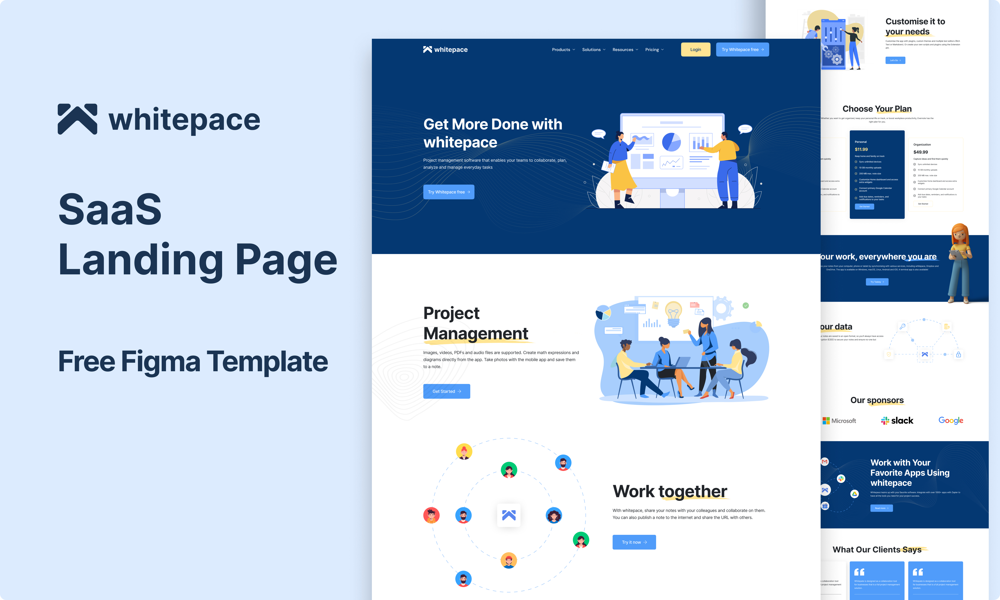

# Whitepace - SaaS Landing Page

This is a SaaS landing page template based on a Figma design by Al Razi Siam. The project involves converting the Figma template into code for a functional landing page.

## Table of contents

- [Overview](#overview)
  - [The Project](#the-project)
  - [Overview Image](#overview-image)
  - [Links](#links)
- [My process](#my-process)
  - [Built with](#built-with)
  - [What I learned](#what-i-learned)
  - [Continued development](#continued-development)
  - [Useful resources](#useful-resources)
- [Author](#author)
- [Credits](#credits)

## Overview

### The Project

Users should be able to:

- View the optimal layout for the interface depending on their device's screen size
- See hover and focus states for all interactive elements on the page (Under Development)

### Overview Image

### Links

- Figma Template URL: [Figma Whitepace](https://www.figma.com/community/file/1156860863353724933)
- Live Site URL: [Netlify](https://chimerical-sopapillas-5843ee.netlify.app/)

## My process

- Coded design system in Tailwind config (colors, fonts, no spacing included in design).
- Created CSS classes for typography instead of using Tailwind for fonts.
- Learned about Radix UI and built a navbar for mobile and other screens.
- Discovered Embla Carousel and used it for the pricing carousel.
- Built the website in sections, following a mobile-first flow.
- Accessibility and SEO were integral parts of the project.

### Built with

- [React](https://reactjs.org/) - JS library
- [Next.js](https://nextjs.org/) - React framework
- [Radix UI](https://www.radix-ui.com/) - UI component library
- [Embla Carousel](https://www.embla-carousel.com/) - Carousel library

### What I learned

- Set up a design system using Tailwind CSS.
- Focused on accessibility and used prebuilt components with Radix UI.
- Implemented a responsive carousel.
- Learned the importance of planning ahead for smoother development.
- Refreshed coding skills post-college.
- Developed pixel-perfect Figma-to-code designs, ensuring responsiveness across all screen sizes.
- Improved knowledge of accessibility and SEO for better website performance.

### Continued Development

- Create the navigation menu for small screens.
- Develop a sub-navigation for larger screens.
- Enhance website accessibility.
- Centralize and refactor website icons.
- Improve accessibility for images and icons.
- Add all image illustrations.
- Optimize website SEO.
- Manage transitions and animations.
- Refactor unnecessary code and spacing.
- Replace all placeholder images.

## Author

- Twitter - [@8xMohab](https://www.twitter.com/8xMohab)

## Credits

- [Figma Design by Siam Alrazi](https://www.figma.com/@alrazisiam)
